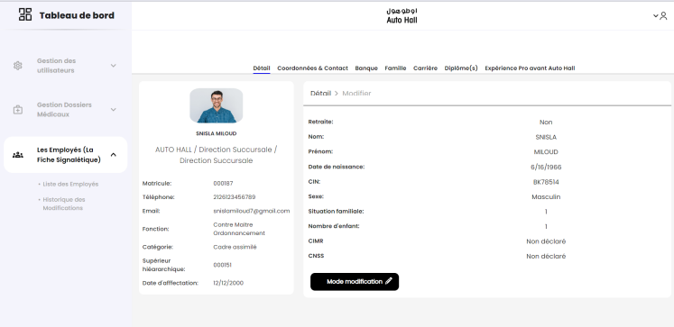

# Auto Hall Employee Management Dashboard

## Project Overview
This project is a comprehensive employee management dashboard developed for Auto Hall using React and TypeScript. The application serves as a dynamic interface to an existing .NET backend API with SQL Server database integration.

## Features
- **Employee Management**: Complete CRUD operations for employee records
- **Employee Details**: View comprehensive employee information including:
  - Personal details (name, birth date, CIN, etc.)
  - Contact information
  - Career path and history
  - Department and hierarchical structure
  - Diplomas and qualifications
  - Banking information
  - Family situation
- **Data Visualization**: Clean and intuitive UI for navigating large datasets
- **Advanced Filtering**: Filter employees by various criteria including matricule
- **Data Export**: Export employee data to Excel
- **Employee History**: Track and view historical changes to employee records
- **Responsive Design**: Works across different device sizes

## Technology Stack
- **Frontend**:
  - React
  - TypeScript
  - Material UI (@mui/material)
  - React Router DOM
  - CSS for custom styling
- **Project Structure**:
  - Component-based architecture
  - Reusable UI components
  - Clean folder organization (assets, components, configs, pages, routes)
- **Backend Integration**:
  - RESTful API consumption
  - JWT Authentication
  - Async data fetching

## Screenshots

### Employee List View

*Browse all employees with filtering capabilities and export options*

### Employee Detail View

*Comprehensive employee information with tabbed navigation*

### Employee Edit Mode

*Form-based editing interface with validation*

### Career Timeline

*Visual representation of employee career progression*

## Implementation Highlights
- **Authentication System**: Secure login with role-based permissions
- **Side Navigation**: Intuitive drawer-based navigation system
- **State Management**: Efficient React state management for data flow
- **Form Handling**: Advanced form controls with validation
- **API Integration**: Structured API service layer for data operations
- **Code Organization**: Well-structured codebase with clear separation of concerns

## Deployment
The application is configured to run on port 3000 locally and can be deployed to any static hosting service.
